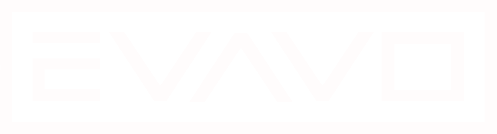

  

<h1 align="center">EVAVO Studio</h1>

<strong>Australian creative technology studio for ambitious digital products, intelligent automation and interactive systems.</strong>

EVAVO is an independent boutique studio combining design, software engineering and technical production. We build polished digital experiences, specialist platforms and production systems for work that benefits from more than an off-the-shelf stack.

Our work spans commercial delivery and private studio R&D across Australia, New Zealand and remote international collaboration.

## Studio capabilities

**Digital products & advanced web**  
Websites, web applications, product interfaces, commerce, content systems and high-performance digital experiences.

**AI-enabled automation & intelligent operations**  
Review-aware agents, research systems, internal tools, workflow automation and operational software designed to reduce repetitive work without removing human control.

**Creative production technology**  
Specialist tooling and governed pipelines for vector, motion, 3D, materials, environments, media and asset production.

**Realtime, 3D & interactive systems**  
Browser and engine-based experiences, realtime visual systems, simulation, interactive installations and technical prototypes.

**Games & simulation**  
Game systems, deterministic simulation, production tooling, automated runtime testing and cross-platform delivery.

**Construction & built-environment technology**  
Project delivery, claims, payment assurance, defects, reporting, commercial controls and operational software designed around AU/NZ workflows.

## Engineering

`TypeScript` · `JavaScript` · `Python` · `C#` · `GDScript` · `Next.js` · `Node.js` · `Godot` · `Cloudflare` · `Vercel`

Behind the public profile, EVAVO maintains a private engineering and R&D estate covering client delivery, original products, creative-production tooling, games, automation, testing, infrastructure and operational systems.

That private-by-default model is deliberate. Public GitHub is a studio-facing surface, not a dump of client code or proprietary production infrastructure.

## Bespoke over borrowed

We design around the actual outcome rather than forcing every brief into the same stack. Proven foundations are reused where they improve reliability, speed and security; custom engineering goes where it materially improves the product, brand or operating model.

Automation cuts repetitive work, not judgement or craft. Security, privacy, accessibility, performance and verification are treated as part of the build.

## EVAVO

Creative technology · digital products · advanced web · AI automation · interactive 3D · games · construction technology

**Australia · AU/NZ · remote**

[evavo.com.au](https://evavo.com.au)
